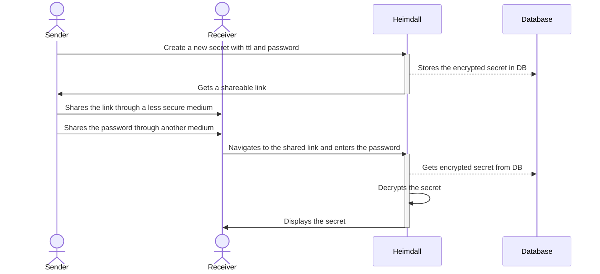

# Heimdall

A web application that lets you share sensitive data in a secure and easy way.

Whether it's wanting to share a password to a team account or share your health
insurance subscription ID with your doctor, Heimdall has you covered.

## Quick Walkthrough

A sender first navigates to Heimdall to create a new secret. The sender can choose
an encryption algorithm (to encrypt the secret at rest), expiration time and
other parameters before hitting the "Create" button. Upon creation, Heimdall will
give the sender an option to copy a shareable link to the secret. The sender can
then share the link with a receiver, who upon navigatin to the page will be
prompted for a password (or a key) which is needed for decrypting the secret. If
the receiver uses the correct key within the expiration period, the receiver
can get the secret.

## Use Cases

## Demo

## Installation

## Features

* Ability to share information as a URL with a TLL.
* Ability to encrypt information using encryption algorithms.
* Supported encryption algoritms:
    * `aes_gcm`: Symmetric-key encryption. Can use any (but same) password to encrypt/send and decrypt/receive information
    * `plaintext`: No password needed to encrypt/send or decrypt/receive
    * `rsa`: Asymmetric-key encryption. Use public key to encrypt/send and private key to decrypt/receive information.
* Encryption of secure information at rest (even when sharing using `plaintext` algo)

## Configurations

Heimdall is built with both ease-of-setup and configurability in mind. We know
that people approach security differently and will have their own use cases
that Heimdall could serve, so we added some of the most common configuration
parameters to Heimdall, powered by environment variables that take affect
at container/application start-time.

| env var name                            | description                                                                                        | default     |
|:---------------------------------------:|:--------------------------------------------------------------------------------------------------:|:-----------:|
|`PRUNE_OLD_SECRETS`                      | Deletes expired/stale (past max attempts) secrets                                                  | true        |
|`SECRETS_PRUNER_INTERVAL_MS`             | Time interval in milliseconds between each prune if `PRUNE_OLD_SECRETS` is `true`                  | 30000       |
|`DELETE_QUERY_TIMEOUT_MS`                | Maximum time in milliseconds each prune query should take if `PRUNE_OLD_SECRETS` is `true`         | 1500        |
|`SECRET_EXPIRATION_CHECK_PERIOD_MS`      | Time interval in milliseconds to check whether a secret is expired when trying to decrypt it       | 5000        |

## Naming

> Heimdall, Old Norse Heimdallr, in Norse mythology, the watchman of the gods

Just how Heimdall protects the Norse gods and Bifrost, the bridge between realms,
this app protects your sensitive data while providing a channel to share it with
others.

> 
>
> Credit: giphy/gifs/marvel-thor-idris-elba-XbPPSwVMWwisg

## About the Team

This app was built as part of Spawnfest 2023 by a wife + husband team: Susan Walker and Adi Iyengar.
Susan has always been interested in Elixir and BEAM-based languages, and Adi being comfortable with
them thought it would be a fun couple's activity try to to build Heimdall at Spanwfest.

* [@thebugcatcher](https://github.com/thebugcatcher)
* [@susanwalker](https://github.com/susanwalker)
